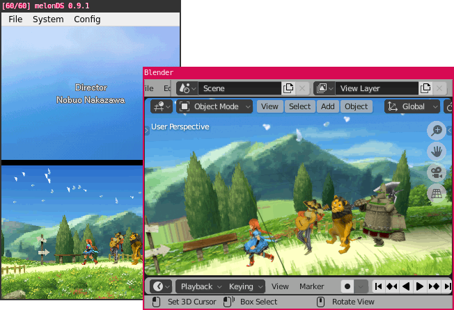
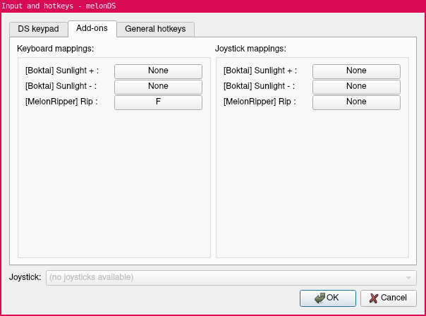

  

<h2 align=center>MelonRipper</h2>

This repo has some stuff for ripping 3D models from the Nintendo DS.
It works Ninja Ripper-style,
where to rip a model, you play in an emulator
until the model is on screen,
then press a key to dump everything drawn in one frame to a file.
A Blender addon can import the dump.

If you want to convert an .nsbmd model file instead,
I have [another project](https://github.com/scurest/apicula)
for that.

## How it works

MelonRipper consists of two parts:
a patched melonDS for ripping dump files,
and a Blender addon for importing them.

### melonDS

First, you need to compile the patched melonDS.
Fetch the branch [scurest:MelonRipper](https://github.com/scurest/melonDS/tree/MelonRipper)
and build it normally.
Build instructions are in melonDS's ReadMe.

<table><tbody><tr><td>
For Windows users, you can also download a
<a href="https://github.com/scurest/melonDS/releases/tag/MelonRipperBuild">precompiled EXE</a>.
</td></tr></tbody></table>

Okay, so you've got your patched melonDS running now.
The patch will have added a new hotkey for ripping a frame.
Go to _Config ‣ Input and hotkeys ‣ Add-ons_
and assign a hotkey to "[MelonRipper] Rip"
(I used [F]).

Then when you are playing a game
press your hotkey to rip everything drawn on the next frame.
The rip is saved to a file named like
`melonrip-YYYY-MM-DD-HH-MM-SS.dump`
in the current directory.

### Blender

You'll need Blender 2.82 or later.

Install the [`import_melon_rip.py`](import_melon_rip.py) file
through _Edit ‣ Preferences ‣ Add-ons ‣ Install..._
and enable the addon "Import: MelonRipper NDS Dumps".
(See the [Blender Manual](https://docs.blender.org/manual/en/latest/editors/preferences/addons.html#rd-party-add-ons)
or [this question](https://blender.stackexchange.com/questions/1688/installing-an-addon/1689)
if you need help installing addons.)

Then go to _File ‣ Import ‣ MelonRipper NDS Dump_
and pick the `.dump` file you ripped with melonDS
to import it.

## Tips and other stuff to know

* If the colors are washed out, you probably need to
  switch Blender's color space from "Filmic" to "Standard".
  See [this answer](https://blender.stackexchange.com/questions/164677/images-as-emitters-constantly-come-out-dull-white-emission-not-actually-white).
  (btw I recommend saving this change to your startup file.)

* If you're having trouble finding the model in Blender,
  try _View ‣ Frame Selected_ in the 3D View
  to fit the selected model into the viewport.
  Walk mode is also useful for navigation.

* Sometimes different parts of the scene are
  displaced relative to each other.
  I think that's because they're drawn with different "cameras".
  (Dumped vertex position are all after the ModelView matrix
  but before the Projection.)

* Normals aren't ripped.
  The calculated lighting from normals is baked into the vertex colors.

* Strip connectivity is not preserved.
  All faces in Blender are totally separate from each other,
  even if they were originally part of a polygon strip.

* Vertex colors in the middle of a quad
  will look different in Blender than on the DS
  because quads on a PC are rendered as two tris,
  while the DS renders quads as real quads.
  The [melonDS blog](http://melonds.kuribo64.net/comments.php?id=122)
  has a great explanation for this.

* Translucent (partially transparent) faces are imported with "Alpha Blend".
  This may have sorting problems in the Eevee renderer.
  If you have sorting issues, try Cycles.

* The material nodes are supposed to simulate a DS pixel pipeline.
  Implemented effects: texturing, modulate, decal, toon, texcoord wrapping.
  Unimplemented: fog, shadow, wireframe, edgemarking, depth equal, rear plane.

* Exporting to .gltf sort of works (use Blender ≥2.92 for best results).
  You will probably need to modify the materials to export to other formats.
